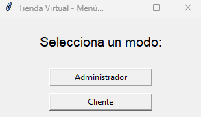

# 🛒 Tienda Virtual - Python + Tkinter

Aplicación de escritorio para gestionar una tienda virtual, con modo **Administrador** y **Cliente**, desarrollada en Python (Tkinter) y persistencia en JSON.

---

## 🚀 Características

- **Administrador**
  - Agregar, modificar y eliminar productos
  - Ver ventas realizadas
  - Gestión de stock en tiempo real

- **Cliente**
  - Ver productos disponibles
  - Comprar productos (actualiza stock)
  - Registro de ventas en `data/ventas.json`

---

## 🎬 Demo (ejemplo)

  
*Menú principal con opciones Cliente / Administrador.*

  
*Panel de administración: lista de productos y acciones.*

  
*Vista del cliente mostrando el carrito.*
---

## 🛠 Tecnologías

- Python 3.x  
- Tkinter (GUI)  
- JSON para persistencia  
- Git & GitHub

---

## 📦 Instalación y ejecución

```bash
git clone https://github.com/ronaldpalomin/tienda_virtual.git
cd tienda_virtual
python -m venv venv
# Windows:
venv\Scripts\activate
# mac/linux:
source venv/bin/activate
# Ejecutar GUI principal
python src/app_gui.py
